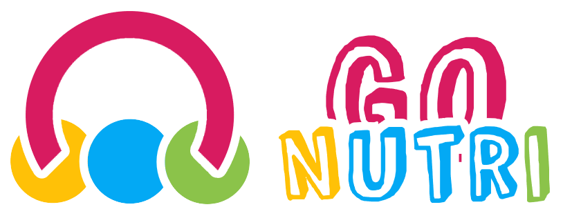
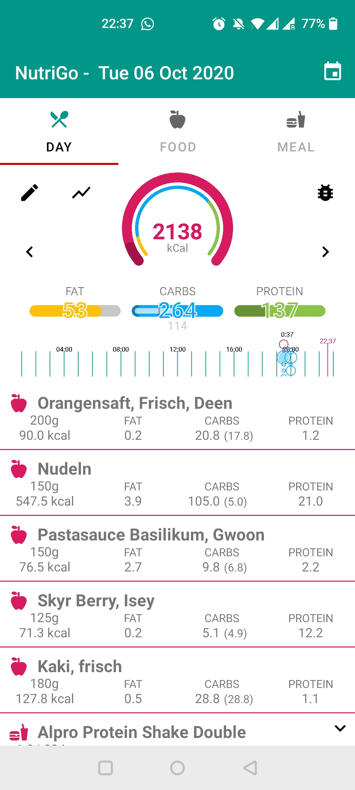
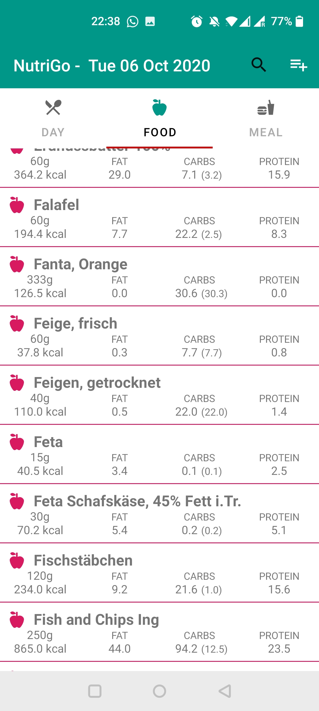
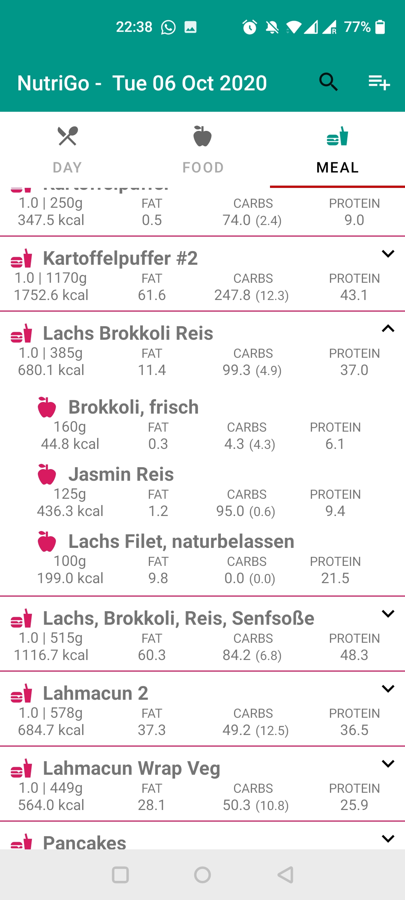

# NutriGo
NutriGo is a nutrition app for Android which allows you to easily track your calories and macros. After trying every available nutrition app I simply decided to build my own. 

# Screenshots
  

# Install
NutriGo is currently not available in the PlayStore to install the app please download the latest release and install it manually on your Android smartphone.

# Development
Currently the app is under no active development!

# Disclaimer
I'm not a nutrition expert and NutriGo is just an app to help you track your daily intake.

The app is provided on an 'as is' basis. We make no warranties, expressed or implied, and hereby disclaim and negate all other warranties including, without limitation, implied warranties or conditions of merchantability, fitness for a particular purpose, or non-infringement of intellectual property or other violation of rights. Further, we do not warrant or make any representations concerning the accuracy, likely results, or reliability of the use of the materials or otherwise relating to such materials or on any sites/apps linked to this app. 

# Limitations
In no event shall we or our suppliers be liable for any damages (including, without limitation, damages for loss of data or profit, or due to business interruption) arising out of the use or inability to use the app, even if we have been notified orally or in writing of the possibility of such damage. Because some jurisdictions do not allow limitations on implied warranties, or limitations of liability for consequential or incidental damages, these limitations may not apply to you. 